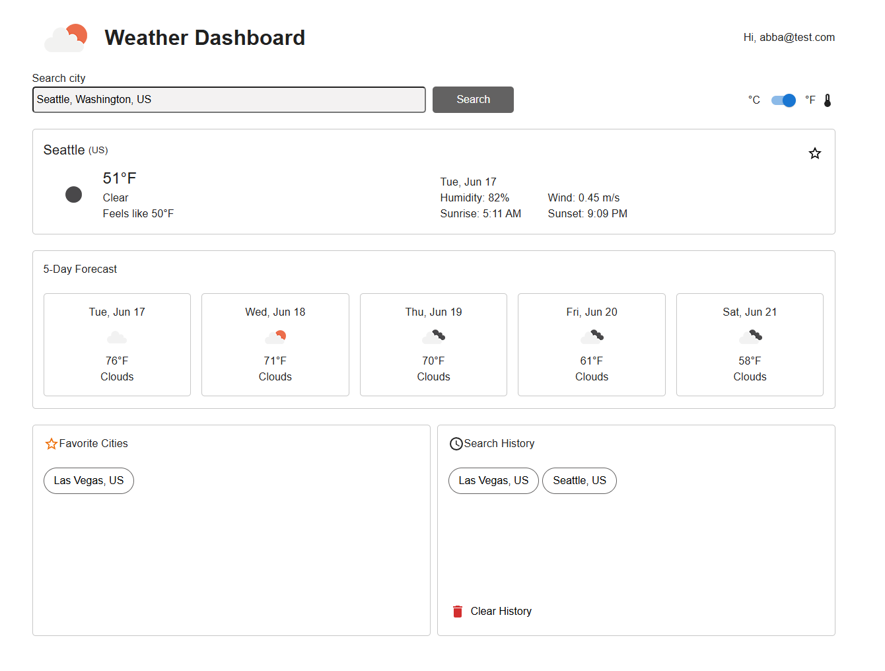
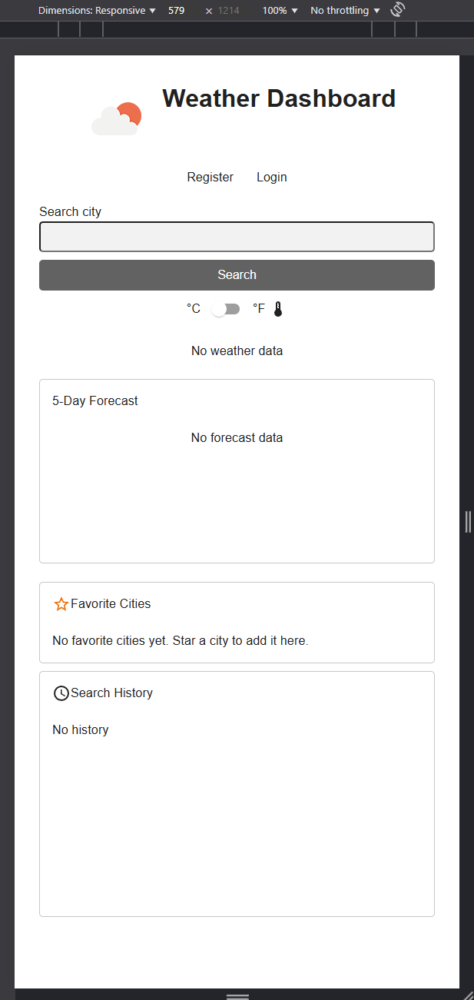
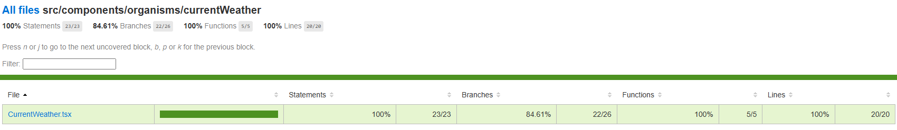
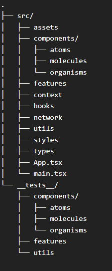
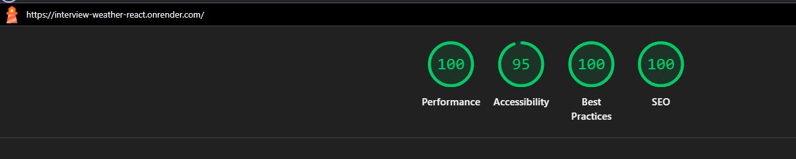
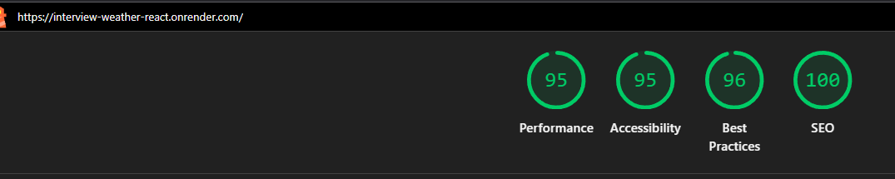

# Interview Weather React App

React app bootstrapped with Vite, written mainly in Typescript with Sass.

## URL
https://interview-weather-react.onrender.com/

**Note: Entire frontend and backend are hosted on a free tier server hence it will take a minute to wake the server up

## App preview

Desktop view



Mobile view



**Note: User must be logged in to enable the favorite cities and search history feature

## Recording

<video src="documentation/recording.mp4"></video>

## Installation

Follow these instructions to setup the backend:

Server app:
<https://github.com/calvert-work/interview-weather-server>

Postgres database:
<https://github.com/calvert-work/interview-weather-db-docker>

Then, install packages and run React server

```bash
  npm install
  npm run dev
```

Provide the server url to your .env file

```bash
  VITE_SERVER_URL=http://localhost:3001
```

## Run tests

Vitest and testing-library are used for unit testing and integration testing

To run tests once:

```bash
  npm run test
```

To watch tests:

```bash
  npm run test:watch
```

To get test coverage:

```bash
  npm run test:coverage
```

Due to short on time, the best integration test case can be found in `CurrentWeather.spec.tsx` along with some basic and simple unit testing on components and utils.



## Folder structure / Architecture

Followed atomic architecture to build UI elements (cons mentioned below)

1. assets folder: to store assets
2. components folder: consist of atoms, molecules, and organisms level UI components

- atoms: small element eg: label, input
- molecules: element made up of a group of atoms, eg: TextInput (label + input)
- organisms: element made up of atoms and/or molecules

3. features folder: feature made up with multiple organisms or with atoms or molecules
4. context folder: state management api (for this small application)
5. hooks folder: custom hooks
6. network folder: mainly axios code and in the future, api code with Tanstack Query for network cache
7. utils folder: utils eg capitalize
8. styles folder: common reuseable style code in scss
9. types folder: common reuseable types/interfaces
10. __tests__ folder: unit test cases and integration test cases mimicking the folder structure of the src folder



## Things I should have done / didn't went well

1. Atomic architecture is good for ensuring component code are reuseable and small but it is very time-consuming. Building each component takes a very long time because the amount of code and tests is huge. It is recommended to use a third party library for quicker development especially for an interview take-home assessment. In a larger organization, most of them have their own UI library hence the feature codebase should be a bit cleaner.
2. Have a repository folder so that api code can go here which reduces the amount of code residing in the feature code.
3. Implement Tanstack Query so that api calls are cached hence not hitting the server that much.
4. Better error handling, some rare cases are not being handled
5. Logging with Datadog
6. Structure the component style code better with scss
7. Refactor some files that have somewhat complex logic
8. Setting up infrastructure took a bit of time

## Lighthouse score

Desktop score


Mobile score


